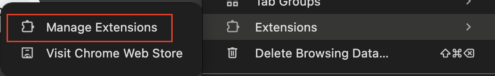
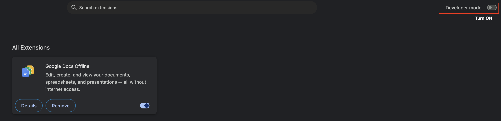
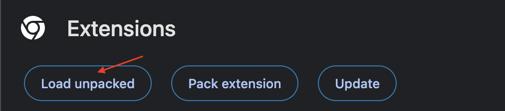

# YT Timestamp Notetaker

Chrome extension for taking timestamped notes while watching YouTube videos.

This is the first test release.

## Release Notes

- Capture the current video timestamp from a YouTube watch page
- Write and save notes tied to that captured timestamp
- Store notes per video URL using `chrome.storage.local`
- Auto-load existing notes for the current video when the popup opens
- Delete individual notes
- Keyboard shortcut: `Ctrl+Enter` (Windows/Linux) or `Cmd+Enter` (Mac) to add a note

## Future Releases

- Click timestamp to jump/seek in the video

## Installation (Load Unpacked in Chrome)

1. Download or clone this repository.
2. Open Chrome and go to `chrome://extensions`.

3. Enable **Developer mode** (top-right).

4. Click **Load unpacked**.

5. Select this project folder (the folder containing `manifest.json`).
6. Pin the extension from the extensions menu if you want quick access.

You can also load it in Chromium-based browsers that support Chrome extensions (Edge, Brave, etc.) with similar steps.

## How to Use

1. Open a YouTube video page (`https://www.youtube.com/watch...`).
2. Click the extension icon to open the popup.
3. Click **Capture Time** to read the current playback time.
4. Type your note in the textarea.
5. Click **Add Note** (or use `Ctrl+Enter` / `Cmd+Enter`).
6. Repeat as needed while watching.

Notes are shown in the popup and associated with the current video URL.

## Permissions

- `storage`: save notes locally in the browser
- `activeTab`, `tabs`, `scripting`: read video time/title from the active YouTube tab
- `host_permissions` for `https://www.youtube.com/*`: run only on YouTube pages

## Testing Notes

- If the popup cannot read the video time, refresh the YouTube tab and try again.
- This version is intentionally minimal for early validation of the capture-and-note workflow.
